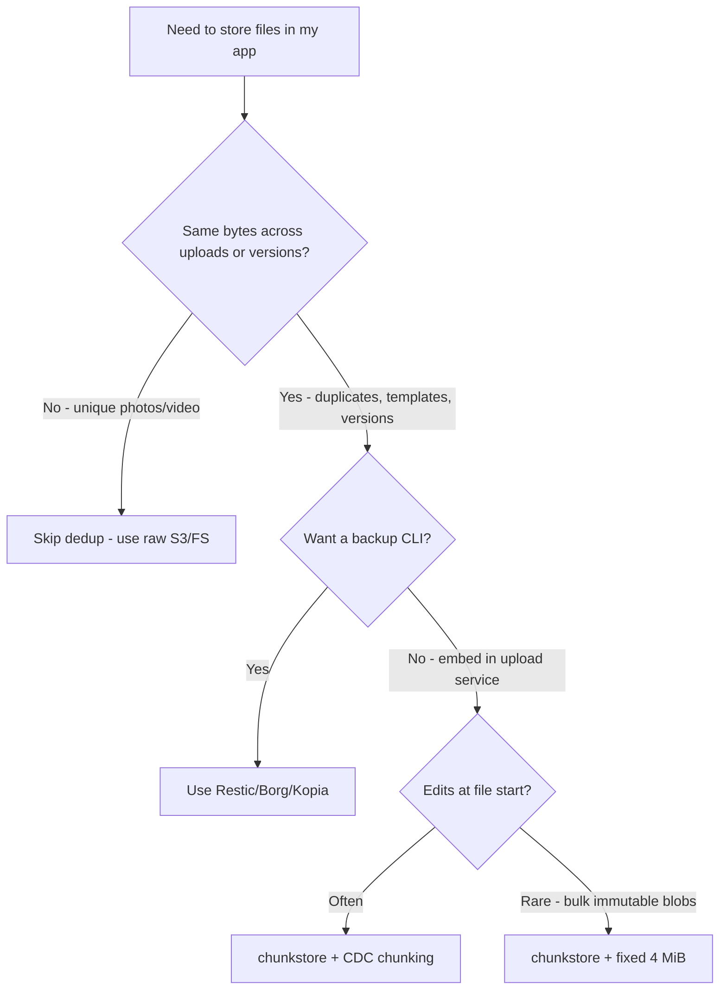
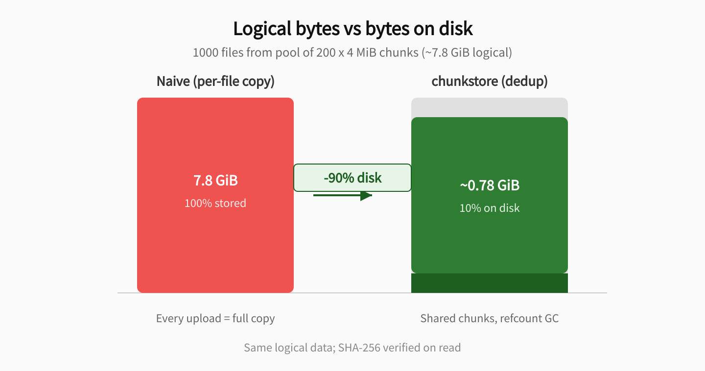
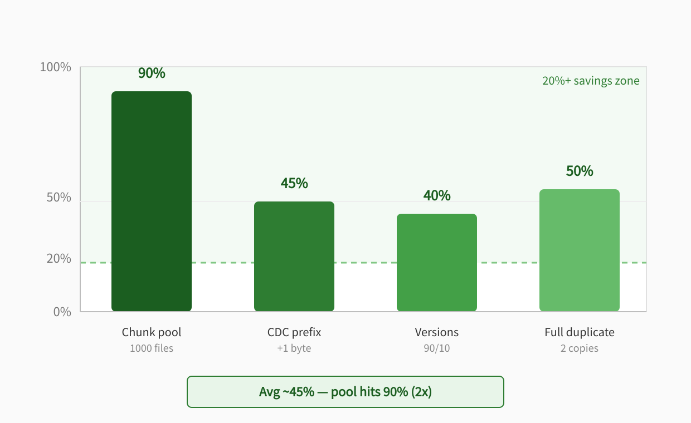
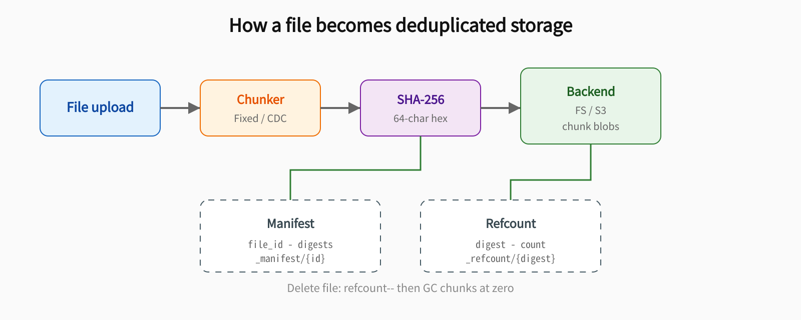
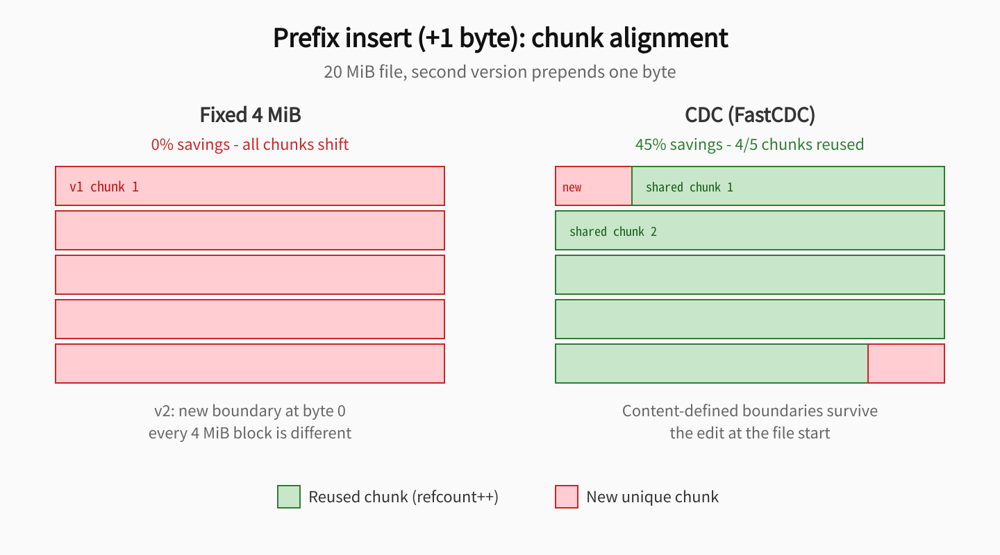
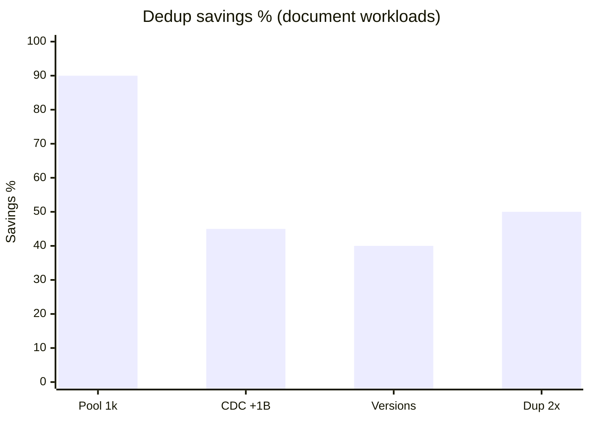

# chunkstore

[](LICENSE)
[](https://github.com/MuratovER/chunkstore/actions/workflows/ci.yml)
[](https://pypi.org/project/chunkstore/)
[](https://pypi.org/project/chunkstore/)
[](core/)
[](python/)

**Embeddable content-addressed chunk storage (CAS)** with byte-level deduplication, reference-count GC, and bindings for **Rust, Python, and Go**.

> Drop a dedup layer into your app — not a backup CLI. When uploads, versions, and templates share bytes, store each unique chunk **once** and cut disk/S3 cost by **up to ~90%** on real workloads (see [benchmarks](#benchmarks)).

---

## Table of contents

- [Quick start](#quick-start)
- [Design principles](#design-principles)
- [Should I use chunkstore?](#should-i-use-chunkstore)
- [The problem](#the-problem)
- [What you get](#what-you-get)
- [Who it's for](#who-its-for)
- [What this is / is not](#what-this-is--is-not)
- [Compared to alternatives](#compared-to-alternatives)
- [How it works](#how-it-works)
- [When dedup works](#when-dedup-works--and-when-it-doesnt)
- [Chunking: fixed vs CDC](#chunking-fixed-vs-cdc)
- [Multi-language](#multi-language)
- [Installation](#installation)
- [Examples](#examples)
- [Benchmarks](#benchmarks)
- [Contributing](#contributing)
- [Roadmap](docs/ROADMAP.md)
- [License](#license)

---

## Quick start

**30 seconds — Python** (PyPI, Linux / macOS / Windows wheels):

```bash
pip install chunkstore
```

```python
from chunkstore import ChunkStore, FilesystemBackend

store = ChunkStore.open(FilesystemBackend("/data/chunks"))
store.ingest("doc_v1", b"hello world")
assert store.read("doc_v1") == b"hello world"
print(store.stats())  # savings_pct grows as you deduplicate
```

**From source** (all platforms, or hacking on the wrapper):

```bash
cd python && maturin develop --release
```

**Rust:**

```bash
cargo build --release && cargo test -p chunkstore-core
```

```rust
use chunkstore::{ChunkStore, FsBackend};

let store = ChunkStore::open(FsBackend::new("/data/chunks")?)?;
store.ingest("doc_v1", b"hello world")?;
println!("{:?}", store.stats()?);
```

**Go** (build core first):

```bash
./scripts/build-core.sh
cd go/chunkstore && go test -v
```

```go
import "github.com/MuratovER/chunkstore/go/chunkstore"

store, _ := chunkstore.OpenFilesystem("/data/chunks")
defer store.Close()
store.Ingest("doc_v1", []byte("hello world"))
```

**S3** (Python or Go — see [docs/S3.md](docs/S3.md)):

```python
from chunkstore import ChunkStore, S3Backend
store = ChunkStore.open(S3Backend("my-bucket", prefix="chunks"))
store.ingest("doc_v1", b"hello world")
```

Cross-language smoke test: `pytest -m cross_lang` (Python write → Go read/delete → Python stats).

---

## Design principles

Patterns borrowed from [Restic](https://github.com/restic/restic), [RocksDB](https://github.com/facebook/rocksdb), and [zstd](https://github.com/facebook/zstd) — applied to an **embeddable** dedup layer:

| Principle | What it means for you |
|-----------|----------------------|
| **Embed** | Library in your process. No daemon, no S3 proxy, no separate backup agent. |
| **Content-addressed** | Chunk key = full SHA-256 hex (64 chars). Same bytes → same key → automatic dedup. |
| **Verifiable** | Every read checks `sha256(data) == digest`. Bit rot and tampering surface immediately. |
| **Efficient** | Refcount + GC: delete a file only drops chunks nothing else references. |
| **Portable** | One on-disk format across Rust, Python, and Go (`_manifest/`, `_refcount/`, chunk blobs). |
| **Honest scope** | Byte-identical dedup only. No perceptual hashing, no distributed metadata. |

**Public API boundary:** language wrappers call the Rust core (PyO3 / cgo / direct crate). Backend layout and metadata keys are stable; internal Rust modules may change between minor versions until v1.0.

---

## Should I use chunkstore?



| Your situation | Recommendation |
|----------------|----------------|
| Document CMS, PDF versions, rescans | **chunkstore + CDC** |
| Idempotent re-upload of same file | **chunkstore** (near 100% savings on re-upload) |
| Template / boilerplate libraries | **chunkstore** (shared chunks across files) |
| Unique camera rolls, encodes, ZIPs | Raw blob storage — dedup ~0% |
| Disaster recovery, off-site backups | **Restic / Borg** — not chunkstore |
| S3-compatible object store for everything | **SeaweedFS / MinIO** — not chunkstore |

---

## The problem

Most apps store files naively: every upload writes a full copy to disk or S3. With document versions, rescans, shared templates, and duplicate uploads, **the same bytes are stored many times**. Blob storage has no dedup API — you either accept the cost or build your own layer.

| Naive storage | What you pay |
|---------------|--------------|
| User uploads the same PDF twice | 2× disk / S3 bytes |
| 100 document versions with 90% shared content | ~100× tail, ~100× shared prefix |
| 1000 files built from 200 shared 4 MiB blocks | Full logical size on disk |

**chunkstore** splits files into chunks, addresses each chunk by **SHA-256**, stores each unique chunk once, and tracks references. Identical bytes → one physical object, `refcount++`. Delete a file → `refcount--` → garbage-collect chunks at zero.

---

## What you get

| Benefit | How |
|---------|-----|
| **Lower storage bill** | Unique chunks stored once; shared prefixes and duplicates reused |
| **Safe reads** | `sha256(chunk_bytes) == digest` on every read |
| **Embeddable library** | Call from upload/versioning code — like embedding RocksDB, not running a DB server |
| **Cross-language format** | Same directory from Python and Go |
| **Pluggable backend** | FS and S3 in wrappers; core uses callbacks or built-in FS |
| **Two chunking modes** | Fixed (fast) and CDC (edit-friendly) |

### Storage impact (measured)

Scenario: **1000 files** from a pool of **200 × 4 MiB** chunks (~7.8 GiB logical).



| Approach | Bytes on disk | Savings vs naive |
|----------|---------------|------------------|
| Naive per-file copy | ~7.8 GiB | — |
| chunkstore dedup | ~0.78 GiB | **~90%** |

### Savings by workload



| Savings band | Meaning |
|--------------|---------|
| **&lt; 10%** | Noise — dedup overhead may not pay off |
| **20–30%** | Noticeable in disk/S3 billing |
| **50%+** | Strong fit: duplicates, clones, versions |
| **80%+** | Shared templates, chunk pools |

---

## Who it's for

| Use case | Why chunkstore |
|----------|----------------|
| **Document management** | PDF versions, scans, templates — large shared prefixes |
| **File upload services** | Same file uploaded twice; resumable re-uploads |
| **File versioning** | v2 = v1 + small edit; CDC keeps chunk boundaries |
| **Multi-service stacks** | Python API writes, Go worker reads — same chunk directory |

**Dogfood target:** document storage / `docs_service` — versioned PDFs, scans, boilerplate templates.

---

## What this is / is not

| chunkstore is | chunkstore is not |
|---------------|-------------------|
| Embeddable CAS/dedup library | Backup CLI (Restic / Borg / Kopia) |
| Dedup layer over FS or S3 | S3 gateway or reverse proxy |
| Byte-identical dedup (SHA-256) | Perceptual / similarity dedup |
| Manifest + refcount + GC | Distributed multi-node store |
| Shared format across Python / Go / Rust | Encryption or compliance product |

**Current limits:** single-process store lock; refcount and metadata on the backend — fine for one app node, not for concurrent multi-writer clusters without external coordination.

---

## Compared to alternatives

### vs raw blob storage (S3 / local FS)

| | Raw S3/FS | chunkstore |
|--|-----------|------------|
| Dedup | None | SHA-256 chunk-level |
| Integration | Native SDK | Library in your app |
| Versioning | Your DB/metadata | `file_id` → manifest |
| Best for | Unique blobs, media | Repeated bytes across files |

### vs backup tools (Restic, Borg, Kopia)

| | Backup tool | chunkstore |
|--|-------------|------------|
| Model | `init` → `backup` → `restore` | `ingest` / `read` / `delete` in-process |
| Encryption / retention | Built-in | Not included |
| Dedup + CDC | Yes (Restic uses Rabin CDC) | Yes — similar ideas, **different format** |
| Fit | Ops / DR | **Application embed** |

> Restic (~35k GitHub stars) solves backup. chunkstore solves **"my upload service stores too many duplicate bytes"** — complementary, not competing.

### vs object stores (SeaweedFS, MinIO)

| | Object store | chunkstore |
|--|--------------|------------|
| API | S3 HTTP | In-process library |
| Scope | Cluster, buckets, ACLs | Single-store dedup layer |
| When to use both | — | chunkstore under your app; object store as **backend** via S3 wrapper |

---

## How it works



```
file → chunks → SHA-256 (64-char hex) → backend
                ↓
         manifest (file_id → [digests])
         refcount (digest → count) → GC when count == 0
```

| Layer | Role |
|-------|------|
| [`core/`](core/) | Rust: chunking, hashing, manifests, refcount, C-API |
| [`python/`](python/) | PyO3/maturin wrapper + FS/S3 backends |
| [`go/`](go/) | cgo wrapper + FS/S3 backends |

**Metadata keys** (shared across languages):

| Key | Content |
|-----|---------|
| `_manifest/{file_id}` | JSON: ordered digests + `file_bytes` |
| `_refcount/{digest}` | JSON: reference count |
| `{digest}` (64 hex) | Raw chunk bytes |

---

## When dedup works — and when it doesn't

### Works well

| Workload | Typical savings | Notes |
|----------|-----------------|-------|
| Pool 200×4 MiB chunks, 1000 files | **~90%** | Benchmark scenario |
| Full duplicate file (2 copies) | **~50%** | Second copy reuses all chunks |
| Partial overlap (shared prefix) | **30–45%** | Only tail chunks are new |
| Document versions (90/10) | **~40%** | 20 MiB files |
| Prefix insert 1 byte + **CDC** | **~45%** | 4/5 CDC chunks reused |
| Re-upload of identical file | **~100%** | All chunks exist |

### Poor or zero savings

| Workload | Typical savings | Why |
|----------|-----------------|-----|
| Prefix insert 1 byte + **fixed 4 MiB** | **~0%** | All boundaries shift |
| Random unique binaries | **~0%** | No overlap |
| Unique photos / video | **~0%** | High entropy |
| JPEG, MP4, ZIP | **~0%** cross-file | Already compressed |



---

## Chunking: fixed vs CDC

| | Fixed (default 4 MiB) | CDC (FastCDC v2020) |
|--|----------------------|---------------------|
| **Speed** | Fastest | Moderate |
| **Chunk sizes** | Uniform | min 256 KiB, avg 4 MiB, max 8 MiB |
| **Best for** | Bulk uploads | Versioned docs, edits at start |
| **Prefix insert (+1 byte)** | ~0% reuse | **~45%** reuse |
| **API** | `ingest` / `Ingest` | `ingest_cdc` / `IngestCDC` |

---

## Multi-language

| Language | Open | Upload | Read | Delete |
|----------|------|--------|------|--------|
| Rust | `ChunkStore::open(FsBackend::new(path)?)` | `ingest` | `read` | `delete` |
| Python | `ChunkStore.open(FilesystemBackend(path))` | `ingest` | `read` | `delete` |
| Go | `chunkstore.OpenFilesystem(path)` | `Ingest` | `Read` | `Delete` |

CI verifies: **Python write → Go read/delete → Python stats** (`pytest -m cross_lang`).

---

## Installation

| Language | Requirements | Command |
|----------|--------------|---------|
| **Python** | Python 3.10+ | `pip install chunkstore` — Linux, macOS, Windows wheels ([PyPI](https://pypi.org/project/chunkstore/)) |
| **Python (dev)** | Rust (maturin) | `cd python && maturin develop --release` |
| **Rust** | Rust 1.70+ | `cargo build --release -p chunkstore-core` |
| **Go** | Go 1.24+, built `libchunkstore.a` | `go get github.com/MuratovER/chunkstore/go@v0.2.0` — see [`go/README.md`](go/README.md) |
| **Extras** | — | `pip install "chunkstore[s3,fastapi,dev]"` |

Docs: [S3 backend](docs/S3.md) · [Chunking guide](docs/CHUNKING.md) · [Rust crate](docs/CRATES.md)

```bash
# Full local verify (from repo root)
./scripts/build-core.sh
cd python && maturin develop --release && pytest -q
cd ../go/chunkstore && go test -v
```

---

## Examples

| Example | Description |
|---------|-------------|
| [`examples/fastapi/`](examples/fastapi/) | Upload / download / delete HTTP API |
| [`examples/fastapi-backup/`](examples/fastapi-backup/) | Gzip backup dumps + SQLite date catalog |
| [`examples/go-http/`](examples/go-http/) | Go HTTP service (upload / download / delete / stats) |

**FastAPI (basic):**

```bash
cd python && maturin develop --release && pip install ".[fastapi]"
PYTHONPATH=../examples/fastapi uvicorn main:app --reload
```

**FastAPI (backup storage pattern):**

```bash
cd python && maturin develop --release && pip install ".[fastapi]"
PYTHONPATH=examples/fastapi-backup uvicorn main:app --host 0.0.0.0 --port 8081 --reload
```

**Go HTTP:**

```bash
CARGO_TARGET_DIR=target cargo build --release -p chunkstore-core
cd examples/go-http && go run .
```

Endpoints: `POST /files/{id}`, `GET /files/{id}`, `DELETE /files/{id}`, `GET /stats`.

---

## Benchmarks

Reproducible workloads via `workload_analysis` — run locally:

```bash
cargo run -p chunkstore-core --example workload_analysis --release
cargo bench -p chunkstore-core
```

| Workload | Savings |
|----------|---------|
| Dedup pool 200×4 MiB, 1000 files | **90.0%** |
| Versions 90/10 | 40.0% |
| Prefix insert + CDC | **45.1%** |
| Full duplicate (2 copies) | **50.0%** |

On document-style workloads above, **chunkstore averages ~45% savings** on typical cases; the shared chunk-pool scenario reaches **90%** — roughly **2×** better.



---

## Contributing

Want to fix a bug, add a feature, or improve bindings? See **[CONTRIBUTING.md](CONTRIBUTING.md)** for:

- local setup and full CI commands
- repository layout and where to put changes
- test requirements (including cross-language)
- Rust / Python / Go style rules
- on-disk format stability rules

**PyPI releases:** [docs/PYPI.md](docs/PYPI.md)

**Roadmap:** [docs/ROADMAP.md](docs/ROADMAP.md)

---

## License

MIT — see [LICENSE](LICENSE).
