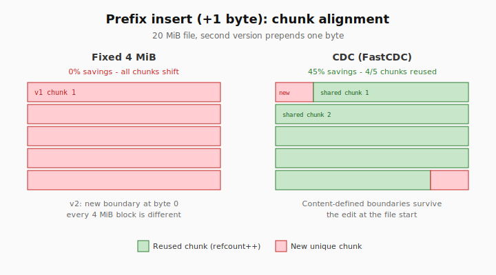

# Chunking: fixed vs CDC

chunkstore supports two chunking strategies in the Rust core, exposed in Python and Go wrappers.

## When to use which

| Situation | Recommended | Typical savings |
|-----------|-------------|-----------------|
| Identical re-uploads, full duplicates | **Fixed** (default 4 MiB) | ~50–100% |
| Document versions with small edits | **CDC** | ~30–45% (90/10 versions) |
| Prefix insert (1 byte at start, ~20 MiB file) | **CDC** | ~45% vs ~0% fixed |
| Random unique binaries, photos, video | Either (dedup ~0%) | ~0% |
| Maximum ingest throughput | **Fixed** | Fastest CPU path |



## Fixed chunking

- Default chunk size: **4 MiB** (`FixedChunker::default_chunk_size()`)
- Predictable boundaries; very fast
- Any edit before a boundary shifts all subsequent chunks → poor savings on small prefix edits

**Python:** `store.ingest(...)`, `store.ingest_fixed(file_id, data, chunk_size)`

**Go:** `store.Ingest(...)`, `store.IngestFixed(file_id, data, chunkSize)`

## CDC (content-defined chunking)

- FastCDC v2020: min 256 KiB, avg 4 MiB, max 8 MiB, window 64
- Boundaries follow content → better reuse when files differ only at edges
- Higher CPU cost than fixed

**Python:** `store.ingest_cdc(...)`, `client.upload_file_cdc(...)`

**Go:** `store.IngestCDC(...)`

## Workload analysis

Run the built-in benchmark (also executed in CI):

```bash
cargo run -p chunkstore-core --example workload_analysis --release
```

Example output interpretation:

| Workload | Fixed savings | CDC savings |
|----------|---------------|-------------|
| Random unique binaries | ~0% | ~0% |
| Document versions (90/10) | moderate | higher |
| Prefix insert 1 byte | ~0% | ~45% |
| Chunk pool reuse (200×4 MiB, 1000 files) | ~90% | similar |

Thresholds:

- **&lt;10%** — noise; dedup may not be worth the complexity
- **20–30%** — noticeable in storage billing
- **50%+** — strong case for chunkstore

## Memory note (v0.2)

`ingest_reader` / `ingest_file_path` (Python) and `IngestReader` / `IngestFile` (Go) read the **entire** input into memory before chunking. True streaming ingest without full-file buffering is planned for v0.3.
