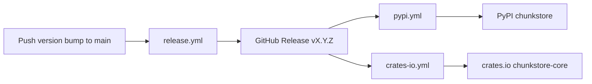

# Release flow (PyPI + crates.io)

One push to `main` with a version bump publishes **Python (PyPI)**, **Rust (crates.io)**, and creates a **GitHub Release**.



## 1. Bump version (maintainer)

Keep in sync:

| File | Field |
|------|--------|
| [`Cargo.toml`](../Cargo.toml) | `[workspace.package] version` |
| [`python/pyproject.toml`](../python/pyproject.toml) | `[project] version` |
| [`python/python_src/chunkstore/__init__.py`](../python/python_src/chunkstore/__init__.py) | `__version__` |

Update [`CHANGELOG.md`](../CHANGELOG.md), then:

```bash
git add Cargo.toml python/pyproject.toml python/python_src/chunkstore/__init__.py CHANGELOG.md
git commit -m "Release vX.Y.Z: …"
git push origin main
```

**Do not** create the tag manually — [`release.yml`](../.github/workflows/release.yml) creates `vX.Y.Z` when the tag does not exist yet.

## 2. Automatic publish

| Trigger | Workflow | Destination |
|---------|----------|-------------|
| GitHub Release **published** | [`pypi.yml`](../.github/workflows/pypi.yml) | [pypi.org/project/chunkstore](https://pypi.org/project/chunkstore/) |
| GitHub Release **published** | [`crates-io.yml`](../.github/workflows/crates-io.yml) | [crates.io/crates/chunkstore-core](https://crates.io/crates/chunkstore-core) |

Check **Actions** after push: `Release` → `Publish to PyPI` → `Publish to crates.io`.

## One-time setup

### PyPI (trusted publishing — no API token in secrets)

See [docs/PYPI.md](PYPI.md). Summary:

| Field | Value |
|-------|--------|
| PyPI project | `chunkstore` |
| GitHub owner / repo | `MuratovER` / `chunkstore` |
| Workflow | `pypi.yml` |
| Environment | `pypi` |

GitHub **Settings → Environments → `pypi`** (optional approval gate).

### crates.io

1. Create API token at [crates.io/settings/tokens](https://crates.io/settings/tokens) (scope: publish `chunkstore-core`).
2. Add repository secret **`CARGO_REGISTRY_TOKEN`** (Settings → Secrets and variables → Actions).
3. First publish may require `cargo owner --add github:MuratovER:chunkstore-core` from a maintainer machine.

No GitHub Environment required for crates.io — only the secret.

## Manual re-publish

If a workflow failed after the release was published:

- **PyPI:** Actions → **Publish to PyPI** → Run workflow (uses existing release event only on `published`; for retry, re-run failed jobs or publish a patch release).
- **crates.io:** Re-run the failed **Publish to crates.io** job, or bump patch version (crates.io does not allow republishing the same version).

## Go module

Go consumers use git tags (no separate registry):

```bash
go get github.com/MuratovER/chunkstore/go@vX.Y.Z
./scripts/build-core.sh
```

See [go/README.md](../go/README.md) and [docs/CRATES.md](CRATES.md).
