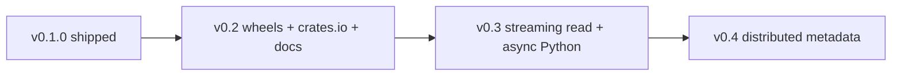

# Roadmap

What is **done in v0.1**, what is **next**, and what we are **not** building.

Status markers:

| Marker | Meaning |
|--------|---------|
| ✅ | Shipped in current tree |
| 🚧 | Started / partial |
| 📋 | Planned |
| ⛔ | Explicitly out of scope |

---

## v0.1 — foundation (current)

Core embeddable CAS layer with cross-language on-disk format.

| Area | Status | Notes |
|------|--------|-------|
| Rust core: fixed + CDC chunking | ✅ | Streaming ingest via `Read` |
| SHA-256 digests, verify on read | ✅ | Full 64-char hex keys |
| Manifests + refcount + GC | ✅ | JSON metadata on backend |
| Rust `FsBackend` | ✅ | |
| C-API / FFI | ✅ | `core/include/chunkstore.h` |
| Python wrapper (PyO3 / maturin) | ✅ | `FilesystemBackend` |
| Python `S3Backend` | ✅ | MinIO integration tests in CI (`python-s3` job) |
| Go wrapper (cgo) | ✅ | `FilesystemBackend`, `S3Backend` (aws-sdk-go-v2) |
| 9 functional scenarios (Rust) | ✅ | `core/tests/scenarios.rs` |
| Python scenario tests | ✅ | In-memory + FS |
| Go unit tests | ✅ | |
| Cross-language test | ✅ | Python write → Go read/delete → Python stats |
| FastAPI example | ✅ | `examples/fastapi/` |
| FastAPI backup example | ✅ | `examples/fastapi-backup/` — gzip dumps + date catalog |
| Workload analysis + benches | ✅ | `workload_analysis`, criterion benches |
| CI (Rust, Python, Go, cross-lang, S3/MinIO, deny/audit) | ✅ | `.github/workflows/ci.yml` |
| README + CONTRIBUTING + charts | ✅ | |
| PyPI publish workflow | ✅ | `.github/workflows/pypi.yml` — trusted publisher + release deploy |
| PyPI package live | ✅ | [`chunkstore` 0.1.0](https://pypi.org/project/chunkstore/0.1.0/) on PyPI |
| Go HTTP example | ✅ | `examples/go-http/` |
| crates.io publish | 📋 | Not automated |
| Public GitHub repo | ✅ | [github.com/MuratovER/chunkstore](https://github.com/MuratovER/chunkstore) |
| Dogfood in document service | 📋 | PDF versions / scans / templates |

---

## v0.2 — distribution & backends

Polish packaging and make S3 + Go production-usable.

### Publishing

| Task | Priority | Details |
|------|----------|---------|
| First PyPI release | ✅ | `v0.1.0` — [pypi.org/project/chunkstore](https://pypi.org/project/chunkstore/) |
| Fix README / badge URLs | ✅ | Links point to `MuratovER/chunkstore` |
| macOS + Windows wheels | ✅ | `pypi.yml`: Linux + macOS universal2 + Windows x64 (abi3) |
| TestPyPI smoke in CI | Low | Optional manual `workflow_dispatch` before each release |
| crates.io crate `chunkstore-core` | Medium | Publish Rust crate; document linking for Go cgo |
| Go module tagging | Medium | Versioned tags; `go get github.com/MuratovER/chunkstore/go@v0.x` |

### Backends & examples

| Task | Priority | Details |
|------|----------|---------|
| Go `S3Backend` | ✅ | aws-sdk-go-v2; MinIO tests in CI (`go-s3` job) |
| S3 integration tests | ✅ | MinIO service in CI (`python-s3` job) |
| S3 backend hardening | Medium | Retries, timeouts, pagination for large buckets |
| `examples/go-http/` | ✅ | Upload / download / delete / stats over HTTP |
| S3 usage docs | Medium | Bucket layout, IAM policy example, prefix conventions |

### API & docs

| Task | Priority | Details |
|------|----------|---------|
| CDC benchmark docs | Medium | When to pick fixed vs CDC; link `workload_analysis` output |
| Python API polish | Medium | Consistent naming (`ingest` vs `upload_file` aliases documented) |
| Go `IngestReader` / path helpers | Medium | Match Rust `ingest_reader_fixed` / CDC |
| CHANGELOG.md | Medium | Keep per release |

---

## v0.3 — streaming & async

Large files and async Python services without loading full blobs in memory.

| Task | Priority | Details |
|------|----------|---------|
| Streaming **read** | High | Iterator / writer callback; avoid `Vec<u8>` for whole file in FFI |
| Streaming read in Python | High | `read_to_writer`, async generators |
| Streaming read in Go | Medium | `io.Writer` target |
| Async Python API | Medium | `asyncio` wrappers for ingest/read where backend is async (S3) |
| Python quality in CI | Medium | `ruff check`, `mypy --strict` job |
| Performance pass | Medium | Profile lock scope; reduce copies on hot path |
| Fuzz CDC + fixed chunkers | Low | `cargo fuzz` for boundary / panic safety |

---

## v0.4+ — scale & enterprise hooks

Multi-instance and optional encryption — only with a clear design.

| Task | Priority | Details |
|------|----------|---------|
| Distributed metadata | High | Postgres or Redis for manifests/refcount (multi-node) |
| Consistency model doc | High | Required before distributed mode |
| Encryption at rest hooks | Medium | Per-chunk or per-repo keys; not a full KMS product |
| Compaction / FSCK | Medium | Detect orphan chunks, rebuild indexes |
| Observability | Medium | Metrics: `stored_bytes`, `savings_pct`, GC counts |
| docs site | Low | MkDocs or similar; API reference generated from Rust/Python |

---

## Repository & CI hygiene

| Task | Status | Notes |
|------|--------|-------|
| Pre-commit: fmt, test, deny, clippy | ✅ | |
| `mypy` / `ruff` in pre-commit or CI | 📋 | Documented in CONTRIBUTING, not enforced in CI |
| Criterion benches in CI (threshold) | 📋 | Optional regression guard |
| Dependabot / Renovate | 📋 | Rust, Python, Go, GitHub Actions |
| Issue templates + PR template | 📋 | Bug / feature / question |
| LICENSE headers | 📋 | Optional; MIT is in root |
| Security policy (`SECURITY.md`) | 📋 | Disclosure contact |

---

## Explicitly out of scope

| Item | Why |
|------|-----|
| Backup CLI (Restic/Borg/Kopia competitor) | Library, not a product |
| S3 gateway / reverse proxy | Client SDK + explicit backend |
| Perceptual / similarity dedup | Byte-identical only |
| UI / admin console | Embeddable layer |
| Built-in encryption product | Hooks only in v0.4+ |
| Multi-node without shared metadata | Unsafe refcount — needs v0.4 design |

---

## Suggested order (next 3 milestones)

1. ~~**Ship v0.1.0**~~ — PyPI `0.1.0`, public repo, CI, S3 backends.
2. **v0.2** — ~~macOS/Windows wheels~~, crates.io, S3 docs, CHANGELOG.
3. **v0.3** — streaming read path end-to-end (Rust → FFI → Python/Go).

---

## How to use this doc

- Pick an item marked 📋 or 🚧 and open a GitHub issue before large PRs.
- When something ships, update this file in the same PR.
- Breaking on-disk format changes need a version bump and migration note — see [CONTRIBUTING.md](../CONTRIBUTING.md#on-disk-format-do-not-break-silently).
